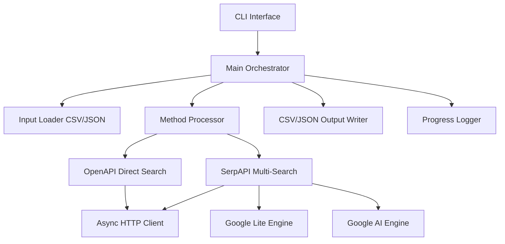
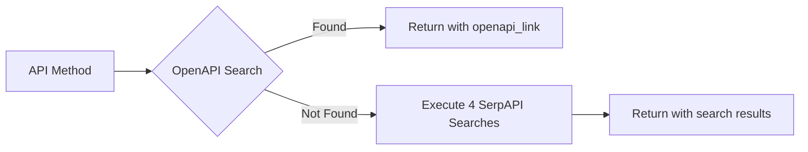

# Design Document

## Overview

API Documentation Finder Agent - это асинхронное Python-приложение, которое автоматизирует поиск документации для API методов из CSV или JSON файлов. Агент использует многоуровневую стратегию поиска: сначала проверяет стандартные пути OpenAPI/Swagger документации, затем выполняет 4 разных поисковых запроса через SerpAPI (google_lite и google_ai движки). Результаты сохраняются в CSV и JSON форматах.

### Key Design Principles

- **Асинхронность**: Использование asyncio и aiohttp для параллельной обработки множества API методов
- **Множественный поиск**: 4 разные поисковые стратегии через SerpAPI для максимального покрытия
- **Приоритет OpenAPI**: Прямая проверка OpenAPI путей минимизирует использование платного API
- **Отказоустойчивость**: Ошибки отдельных методов не останавливают общий процесс
- **Наблюдаемость**: Детальное логирование и прогресс-бар для мониторинга

## Architecture



### Component Flow

1. **CLI** парсит аргументы и инициализирует Main Orchestrator
2. **Input Loader** загружает API методы из CSV или JSON файла
3. Для каждого API метода:
   - **OpenAPI Direct Search** проверяет стандартные пути OpenAPI/Swagger
   - Если найдено, сохраняет в openapi_link и пропускает SerpAPI
   - Если не найдено, **SerpAPI Multi-Search** выполняет 4 поисковых запроса:
     - Google Lite: "{name} {method} api documentation link" → search_method_name
     - Google Lite: "{name} {method_link} api documentation" → search_method_link
     - Google AI: "{name} {method} api documentation link" → ai_method_name
     - Google AI: "{name} {method_link} api documentation" → ai_method_link
   - Результат логируется
4. **CSV/JSON Output Writer** сохраняет все результаты в оба формата

## Components and Interfaces

### 1. CLI Module (`cli.py`)

**Responsibility**: Парсинг аргументов командной строки и запуск приложения

```python
class CLIArguments:
    input_file: str          # Path to input CSV or JSON file
    output_base: str         # Base name for output files (default: results)
    serpapi_key: str         # Hardcoded SerpAPI key

def parse_arguments() -> CLIArguments:
    """Parse and validate CLI arguments"""
    pass
```

### 2. Input Loader (`loader.py`)

**Responsibility**: Загрузка и парсинг входных CSV или JSON файлов

```python
class APIMethod:
    name: str
    method: str
    method_link: str

class InputLoader:
    @staticmethod
    def load_from_file(file_path: str) -> List[APIMethod]:
        """
        Load API methods from CSV or JSON file
        Detects format by extension
        """
        pass
    
    @staticmethod
    def _load_csv(file_path: str) -> List[APIMethod]:
        """Parse CSV file with columns: name, method, method_link"""
        pass
    
    @staticmethod
    def _load_json(file_path: str) -> List[APIMethod]:
        """Parse JSON array of objects"""
        pass
```

### 3. HTTP Client (`http_client.py`)

**Responsibility**: Асинхронные HTTP запросы с управлением соединениями

```python
class AsyncHTTPClient:
    def __init__(self, max_concurrent: int = 20):
        """Initialize aiohttp session with connection limits"""
        self.session: Optional[aiohttp.ClientSession] = None
        self.semaphore = asyncio.Semaphore(max_concurrent)
    
    async def __aenter__(self):
        """Create aiohttp session"""
        pass
    
    async def __aexit__(self, exc_type, exc_val, exc_tb):
        """Close aiohttp session"""
        pass
    
    async def head(self, url: str, timeout: int = 10) -> int:
        """Perform HEAD request and return status code"""
        pass
    
    async def get(self, url: str, timeout: int = 10) -> Optional[str]:
        """Perform GET request with semaphore control"""
        pass
```

### 4. OpenAPI Direct Search (`openapi_search.py`)

**Responsibility**: Проверка стандартных путей OpenAPI/Swagger документации

```python
class OpenAPISearch:
    STANDARD_PATHS = [
        '/openapi.json',
        '/openapi.yaml', 
        '/swagger.json',
        '/swagger.yaml',
        '/api-docs',
        '/redoc'
    ]
    
    def __init__(self, http_client: AsyncHTTPClient):
        self.http_client = http_client
    
    async def find_openapi(self, method_link: str) -> Optional[str]:
        """
        Search for OpenAPI documentation in standard paths
        Returns OpenAPI URL if found, None otherwise
        """
        pass
    
    def _extract_domain(self, url: str) -> str:
        """Extract base domain from method_link URL"""
        pass
    
    async def _check_path(self, base_url: str, doc_path: str) -> bool:
        """Check if OpenAPI path exists (HEAD then GET if needed)"""
        pass
```

**Algorithm**:
1. Парсинг method_link URL для извлечения домена
2. Для каждого стандартного пути в приоритетном порядке:
   - Формирование полного URL: `https://{domain}{standard_path}`
   - Асинхронный HEAD запрос
   - Если статус 200, возврат URL документации
   - Если HEAD не поддерживается, попытка GET запроса
3. Если ничего не найдено, возврат None

### 5. SerpAPI Multi-Search (`serp_search.py`)

**Responsibility**: Множественный поиск документации через SerpAPI с разными движками

```python
class SerpAPIMultiSearch:
    def __init__(self, api_key: str, http_client: AsyncHTTPClient):
        self.api_key = api_key
        self.http_client = http_client
        self.base_url = "https://serpapi.com/search.json"
    
    async def search_all(self, api_method: APIMethod) -> SearchResults:
        """
        Execute all 4 search queries and return results
        """
        pass
    
    async def _search_google_lite(self, query: str) -> Optional[str]:
        """
        Execute google_lite search and extract first organic result link
        """
        pass
    
    async def _search_google_ai(self, query: str) -> Optional[str]:
        """
        Execute google_ai search and extract first result link
        """
        pass

class SearchResults:
    search_method_name: Optional[str]      # google_lite: "{name} {method} api documentation link"
    search_method_link: Optional[str]      # google_lite: "{name} {method_link} api documentation"
    ai_method_name: Optional[str]          # google_ai: "{name} {method} api documentation link"
    ai_method_link: Optional[str]          # google_ai: "{name} {method_link} api documentation"
```

**Search Query Examples**:
```
# Query 1 (google_lite):
bitrix24 add user api documentation link

# Query 2 (google_lite):
bitrix24 https://api.bitrix24.com/rest/user.add api documentation

# Query 3 (google_ai):
bitrix24 add user api documentation link

# Query 4 (google_ai):
bitrix24 https://api.bitrix24.com/rest/user.add api documentation
```

### 6. Method Processor (`processor.py`)

**Responsibility**: Координация поиска документации для одного API метода

```python
class MethodProcessor:
    def __init__(
        self,
        openapi_search: OpenAPISearch,
        serp_search: SerpAPIMultiSearch
    ):
        self.openapi_search = openapi_search
        self.serp_search = serp_search
    
    async def process_method(self, api_method: APIMethod) -> ProcessingResult:
        """
        Process single API method through search pipeline:
        1. Try OpenAPI direct search
        2. If not found, execute all 4 SerpAPI searches
        """
        pass

class ProcessingResult:
    name: str
    method: str
    method_link: str
    openapi_link: Optional[str]
    search_method_name: Optional[str]
    search_method_link: Optional[str]
    ai_method_name: Optional[str]
    ai_method_link: Optional[str]
```

**Processing Pipeline**:


### 7. Progress Logger (`logger.py`)

**Responsibility**: Логирование прогресса и результатов

```python
class ProgressLogger:
    def __init__(self, total_methods: int):
        self.pbar = tqdm(total=total_methods, desc="Processing API methods")
    
    def log_success(self, name: str, method: str):
        """Log successful processing"""
        # ✅ найдено для {name} {method}
        pass
    
    def log_error(self, name: str, method: str, error: str):
        """Log processing error"""
        # ❌ ошибка для {name} {method}: <error>
        pass
    
    def update(self):
        """Update progress bar"""
        pass
    
    def close(self):
        """Close progress bar"""
        pass
```

### 8. Output Writer (`output.py`)

**Responsibility**: Сохранение результатов в CSV и JSON форматы

```python
class OutputWriter:
    @staticmethod
    def save_results(results: List[ProcessingResult], output_base: str):
        """
        Save results to both CSV and JSON files
        Creates {output_base}.csv and {output_base}.json
        """
        pass
    
    @staticmethod
    def _save_csv(results: List[ProcessingResult], file_path: str):
        """Save results to CSV with proper column order"""
        pass
    
    @staticmethod
    def _save_json(results: List[ProcessingResult], file_path: str):
        """Save results to JSON as array of objects"""
        pass
```

### 9. Main Orchestrator (`main.py`)

**Responsibility**: Координация всех компонентов и управление жизненным циклом

```python
async def main():
    """Main entry point"""
    # 1. Parse CLI arguments
    args = parse_arguments()
    
    # 2. Load API methods from input file
    api_methods = InputLoader.load_from_file(args.input_file)
    
    # 3. Initialize components
    async with AsyncHTTPClient(max_concurrent=20) as http_client:
        openapi_search = OpenAPISearch(http_client)
        serp_search = SerpAPIMultiSearch(args.serpapi_key, http_client)
        processor = MethodProcessor(openapi_search, serp_search)
        
        # 4. Process methods concurrently
        logger = ProgressLogger(len(api_methods))
        tasks = [process_with_logging(processor, method, logger) for method in api_methods]
        results = await asyncio.gather(*tasks, return_exceptions=True)
        
        # 5. Save results to CSV and JSON
        OutputWriter.save_results(results, args.output_base)
        
        # 6. Cleanup
        logger.close()

async def process_with_logging(
    processor: MethodProcessor,
    api_method: APIMethod,
    logger: ProgressLogger
) -> ProcessingResult:
    """Process API method and log result"""
    try:
        result = await processor.process_method(api_method)
        logger.log_success(api_method.name, api_method.method)
        return result
    except Exception as e:
        logger.log_error(api_method.name, api_method.method, str(e))
        # Return result with all fields as "error"
        return ProcessingResult(
            api_method.name,
            api_method.method,
            api_method.method_link,
            "error", "error", "error", "error", "error"
        )
    finally:
        logger.update()
```

## Data Models

### Input Format CSV (`input.csv`)

```csv
name,method,method_link
bitrix24,add user,https://api.bitrix24.com/rest/user.add
bitrix24,get user,https://api.bitrix24.com/rest/user.get
github,list users,https://api.github.com/users
```

### Input Format JSON (`input.json`)

```json
[
  {
    "name": "bitrix24",
    "method": "add user",
    "method_link": "https://api.bitrix24.com/rest/user.add"
  },
  {
    "name": "bitrix24",
    "method": "get user",
    "method_link": "https://api.bitrix24.com/rest/user.get"
  },
  {
    "name": "github",
    "method": "list users",
    "method_link": "https://api.github.com/users"
  }
]
```

### Output Format CSV (`results.csv`)

```csv
name,method,method_link,openapi_link,search_method_name,search_method_link,ai_method_name,ai_method_link
bitrix24,add user,https://api.bitrix24.com/rest/user.add,https://api.bitrix24.com/openapi.json,,,,
github,list users,https://api.github.com/users,,https://docs.github.com/rest,https://docs.github.com/rest/users,https://docs.github.com/rest,https://docs.github.com/rest/users
```

### Output Format JSON (`results.json`)

```json
[
  {
    "name": "bitrix24",
    "method": "add user",
    "method_link": "https://api.bitrix24.com/rest/user.add",
    "openapi_link": "https://api.bitrix24.com/openapi.json",
    "search_method_name": "",
    "search_method_link": "",
    "ai_method_name": "",
    "ai_method_link": ""
  },
  {
    "name": "github",
    "method": "list users",
    "method_link": "https://api.github.com/users",
    "openapi_link": "",
    "search_method_name": "https://docs.github.com/rest",
    "search_method_link": "https://docs.github.com/rest/users",
    "ai_method_name": "https://docs.github.com/rest",
    "ai_method_link": "https://docs.github.com/rest/users"
  }
]
```

## Error Handling

### Error Categories

1. **Network Errors**
   - Connection timeout (10 seconds)
   - DNS resolution failure
   - Connection refused
   - SSL certificate errors

2. **HTTP Errors**
   - 4xx client errors (404, 403, etc.)
   - 5xx server errors
   - Invalid response format

3. **SerpAPI Errors**
   - Invalid API key
   - Rate limit exceeded
   - No results found
   - API service unavailable

4. **File I/O Errors**
   - Input file not found
   - Output file write permission denied
   - Invalid file format

### Error Handling Strategy

```python
# All errors are caught and recorded as "error" in corresponding fields
try:
    result = await process_method(api_method)
except asyncio.TimeoutError:
    # Store "error" in all search fields
    pass
except aiohttp.ClientError as e:
    # Store "error" in failed field
    pass
except Exception as e:
    # Store "error" in all fields
    pass
finally:
    # Always save result (success or error) to output files
    pass
```

### Retry Logic

- **No automatic retries** для HTTP запросов (чтобы не увеличивать время обработки)
- Пользователь может повторно запустить агент для обработки неудачных методов
- Ошибки записываются как "error" в соответствующих полях

## Testing Strategy

### Unit Tests

1. **Input Loader Tests**
   - Test CSV parsing with valid data
   - Test JSON parsing with valid data
   - Test handling of missing required fields
   - Test file format detection

2. **OpenAPI Search Tests**
   - Test domain extraction from various URL formats
   - Test standard path checking with mocked HTTP responses
   - Test HEAD/GET fallback logic

3. **SerpAPI Multi-Search Tests**
   - Test query building for different API methods
   - Test response parsing for google_lite engine
   - Test response parsing for google_ai engine
   - Test error handling for API failures

4. **Method Processor Tests**
   - Test complete processing pipeline with mocked dependencies
   - Test OpenAPI search success scenario
   - Test SerpAPI fallback with all 4 queries
   - Test error recording

### Integration Tests

1. **End-to-End Test**
   - Create test input CSV and JSON files
   - Run agent with test configuration
   - Verify output CSV and JSON contain expected results

2. **Concurrency Test**
   - Test with 50+ API methods to verify semaphore limiting
   - Verify no more than 20 concurrent connections
   - Verify all methods are processed

3. **Error Resilience Test**
   - Include invalid URLs in input
   - Include non-existent domains
   - Verify agent completes and records "error" in fields

### Manual Testing

1. **Real API Test**
   - Test with real Bitrix24 API methods
   - Test with real GitHub API methods
   - Verify documentation URLs are correct

2. **SerpAPI Integration Test**
   - Test with real SerpAPI key
   - Verify google_lite and google_ai results
   - Monitor API usage and costs

## Performance Considerations

### Concurrency Limits

- **20 concurrent requests** балансирует скорость и нагрузку на систему
- Для 100 API методов при среднем времени запроса 2 секунды:
  - Без параллелизма: ~200 секунд (3.3 минуты)
  - С 20 параллельными: ~10 секунд

### Memory Usage

- **aiohttp connection pooling** ограничивает использование памяти
- **In-memory results** эффективно для разумного количества методов
- **CSV/JSON output** записывается после завершения всех запросов

### Network Optimization

- **Connection reuse** через aiohttp.ClientSession
- **DNS caching** автоматически в aiohttp
- **Timeout 10 seconds** предотвращает зависание на медленных серверах
- **HEAD requests first** для OpenAPI проверки минимизируют трафик

### SerpAPI Cost Optimization

- **OpenAPI search first** минимизирует использование платного API
- **4 search queries per method** только если OpenAPI не найден
- Для 100 методов, если 50% найдено через OpenAPI:
  - SerpAPI calls: 50 * 4 = 200 запросов
  - Cost estimate: $1-2 (зависит от тарифа)

## Configuration

### Hardcoded SerpAPI Key

```python
SERPAPI_KEY = "dc2bf39c68168f9a35abdac1b265db678d4e97537344e7dee9848c46e7b43b72"
```

### CLI Usage

```bash
# Basic usage with CSV input
python main.py --input input.csv

# With JSON input
python main.py --input input.json

# Custom output base name
python main.py --input input.csv --output my_results

# Full example
python main.py --input data/api_methods.csv --output data/results
```

This will create:
- `results.csv` (or `data/results.csv`)
- `results.json` (or `data/results.json`)

## Dependencies

```
aiohttp>=3.9.0        # Async HTTP client
asyncio               # Built-in async framework
tqdm>=4.66.0          # Progress bar
argparse              # Built-in CLI parser
csv                   # Built-in CSV parser
json                  # Built-in JSON parser
urllib.parse          # Built-in URL parsing
```

Note: SerpAPI requests will be made directly via aiohttp, no separate serpapi library needed.

## Project Structure

```
api-doc-finder/
├── main.py                 # Entry point and orchestration
├── cli.py                  # CLI argument parsing
├── loader.py               # Input CSV/JSON loader
├── http_client.py          # Async HTTP client wrapper
├── openapi_search.py       # OpenAPI direct search
├── serp_search.py          # SerpAPI multi-search integration
├── processor.py            # Method processing pipeline
├── logger.py               # Progress logging
├── output.py               # CSV/JSON output writer
├── requirements.txt        # Python dependencies
└── README.md              # Usage documentation
```
